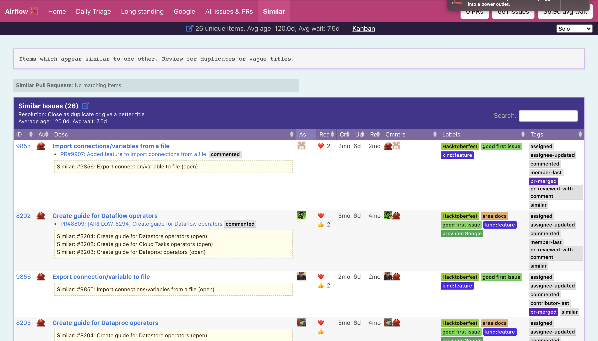
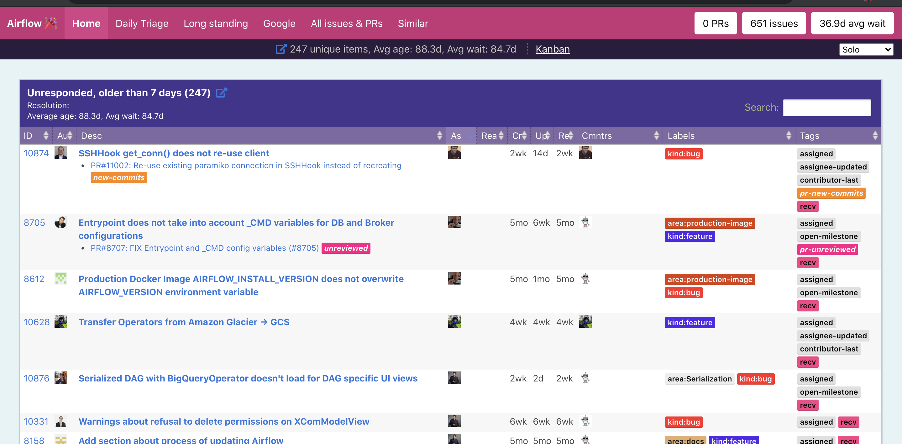
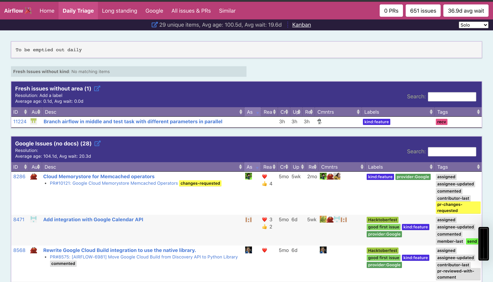
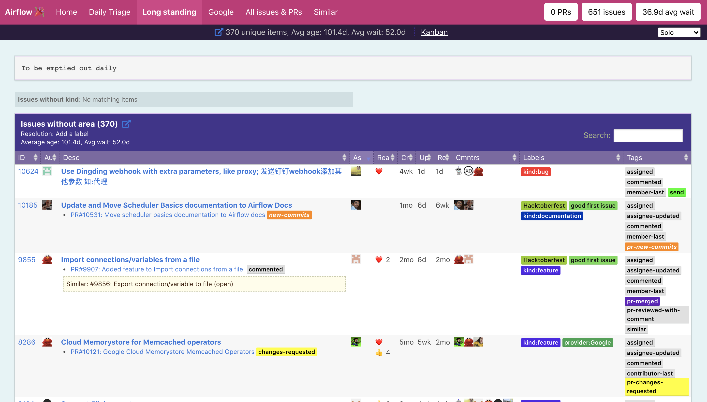
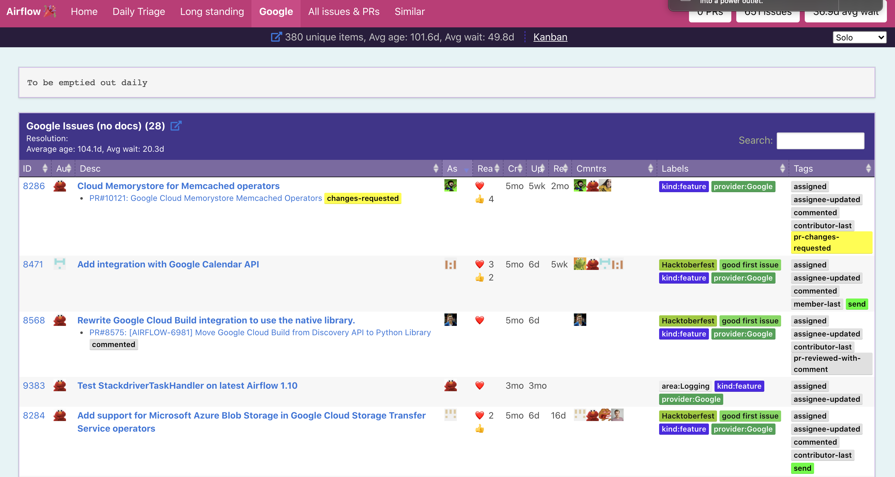

# Triage-party for Airflow

[Triage party](https://github.com/google/triage-party) configurations for [the Apache Airflow](https://github.com/apache/airflow) project with scripts for quick local start and configuration for CI/CD.

Link to deployed app: https://airflow-triage-party-srv-3p5j5jq7xq-ez.a.run.app/s/home

## Quick start

Before running the application locally, you must meet the following prerequisite:

- you must have [Github CLI](https://github.com/cli/cli) and you must be logged in to it.

Once you complete this, you can run the command below:

```bash
# Fetch triage-party repository
git submodule update --init --recursive

# Build docker image
bash build.sh

# Run app.
bash run.sh
```
## CI/CD

All changes merged into the master branch are automatically published by Github Action/Terraform on GCP using Cloud Run and Cloud SQL.

Link to deployed app: https://airflow-triage-party-srv-3p5j5jq7xq-ez.a.run.app/s/home

## Screenshot






